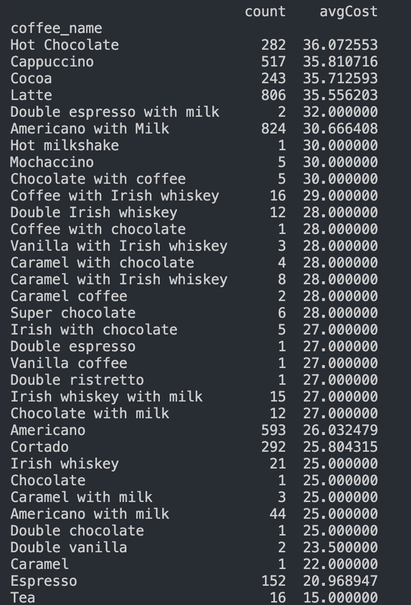
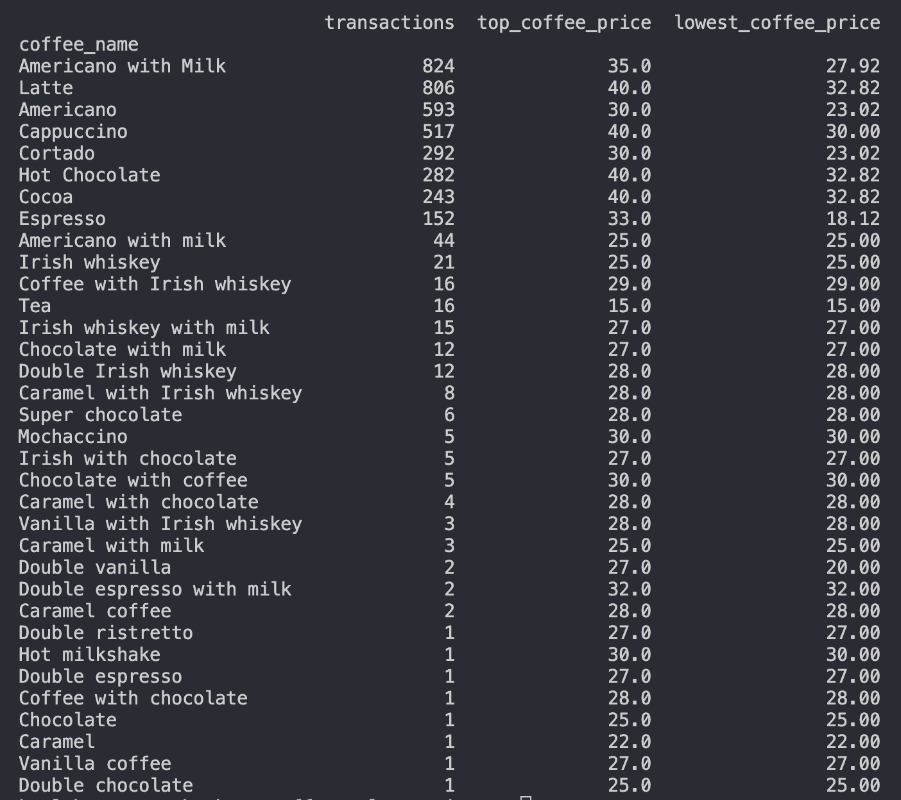

QUESTIONS TO ANSWER FROM THIS DATASET:

This is a project consisting of retrieving sample dataset from kaggle on 2 vending machines that sell coffee. My attempt here is to get a better understanding of the syntax of pandas and apply the dataframe functions to an actual dataset. This was good experience to sample. Not all datasets will be as friendly as this one and I'm looking forward to testing more datasets with syntax from the API reference on Pandas website. 

What is the total revenue? 
    $122,321.58
What is the average price per coffee? 
    $31.381
What is the highest priced and lowest priced coffee? 
    highest priced were latte, cappuccino, hot chocolate, cocoa.
    lowest priced coffe_name is Tea.
What is the most purchased coffee?
     Americano with milk is the most purchased
What is the least purchased coffee? 
    double ristretto, double chocolate, hot mlkshake, chocolate, vanilla coffee, coffee with chocolate, double espresso, caramel all got received 1 as the least purchased.
How many times was each coffee sold?

How many transactions were cash vs card?
    

Which coffee generates the most total revenue? 
    latte was top revenue with $28,658.30
Is the most popular coffee also the most profitable? 
    The most popular, Americano with Milk, was not the most profitable. it came in 2nd in profit with $25,269.12.
What is the average price per coffee type?

Do higher-priced coffees sell less? 
    based on the previous image, higher priced coffee does sell a lot.
What percentage of transactions are card vs cash?
    95.66% were sales from card and 4.34% were made in cash
Does payment type affect how much people spend?
    no, they do not. 

What is the average transaction value per payment type?
    average transaction for card is 31.41 and 30.81 for cash. 
Do card users spend more than cash users?
    card users on everage spend a little bit more based on avg_transaction.
Which coffees are top performers vs underperformers?
    
If you removed the lowest-performing coffee, how much revenue would you lose?
    removing the last performing coffee would remove $211 from total. 

