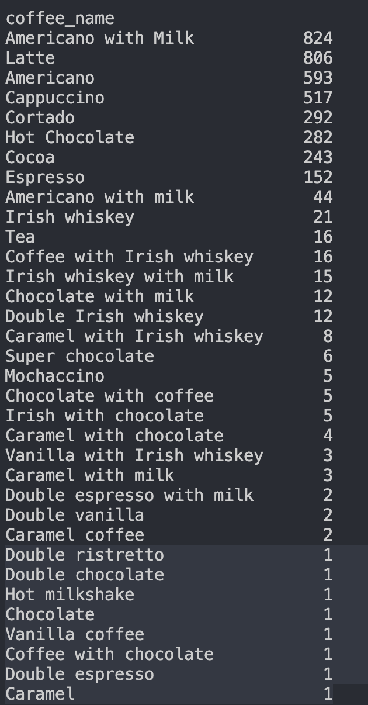
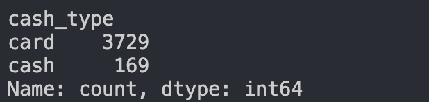

QUESTIONS TO ANSWER FROM THIS DATASET:

What is the total revenue? 122321.57999999999
What is the average price per coffee? 31.380600307850177
What is the highest priced and lowest priced coffee? 
    highest priced were latte, cappuccino, hot chocolate, cocoa.
    lowest priced coffe_name is Tea.
What is the most purchased coffee? americano with milk is the most purchased
What is the least purchased coffee? 
    double ristretto, double chocolate, hot mlkshake, chocolate, vanilla coffee, coffee with chocolate, double espresso, caramel all got received 1 as the least purchased.
How many times was each coffee sold?

How many transactions were cash vs card?
    
Which coffee generates the most total revenue?
Is the most popular coffee also the most profitable?
What is the average price per coffee type?
Do higher-priced coffees sell less?
What percentage of transactions are card vs cash?
Does payment type affect how much people spend?

What is the average transaction value per payment type?
Do card users spend more than cash users?
Which coffees are top performers vs underperformers?
If you removed the lowest-performing coffee, how much revenue would you lose?
(If you have time data) When is the peak time for coffee sales?